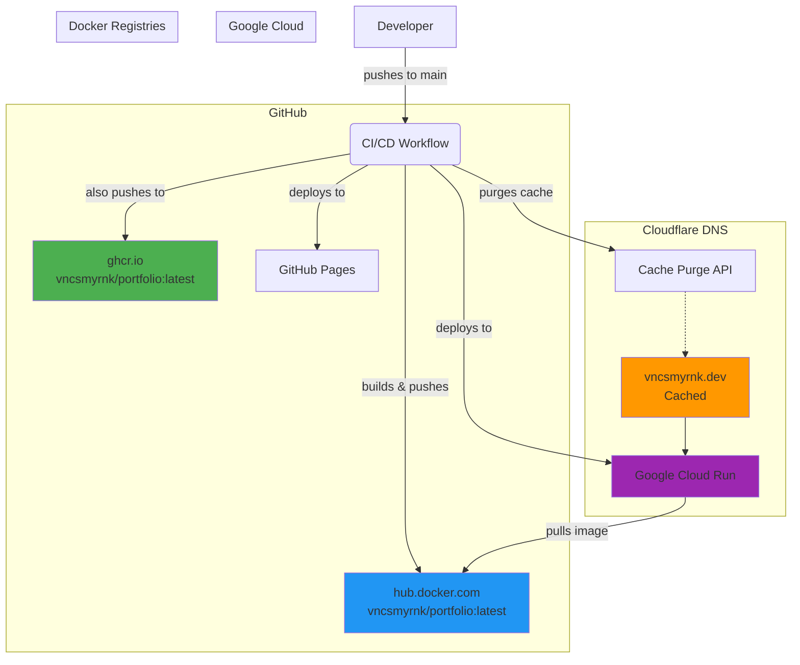

# My portfolio


<br>

[](https://github.com/prettier/prettier)

All my skills and accomplishments showcased in one place.

[Check it out!](https://vncsmyrnk.dev)

## Service Architecture



Check [the latest action runs](https://github.com/vncsmyrnk/portfolio/actions) for more information.

This project uses [just](https://github.com/casey/just) running development tasks.

```bash
just build-dev-env run-dev-env # Builds and runs the dev container
just dev-run # Runs the app (must be run inside the container)
```

The local environment should be available at http://localhost:3000.
