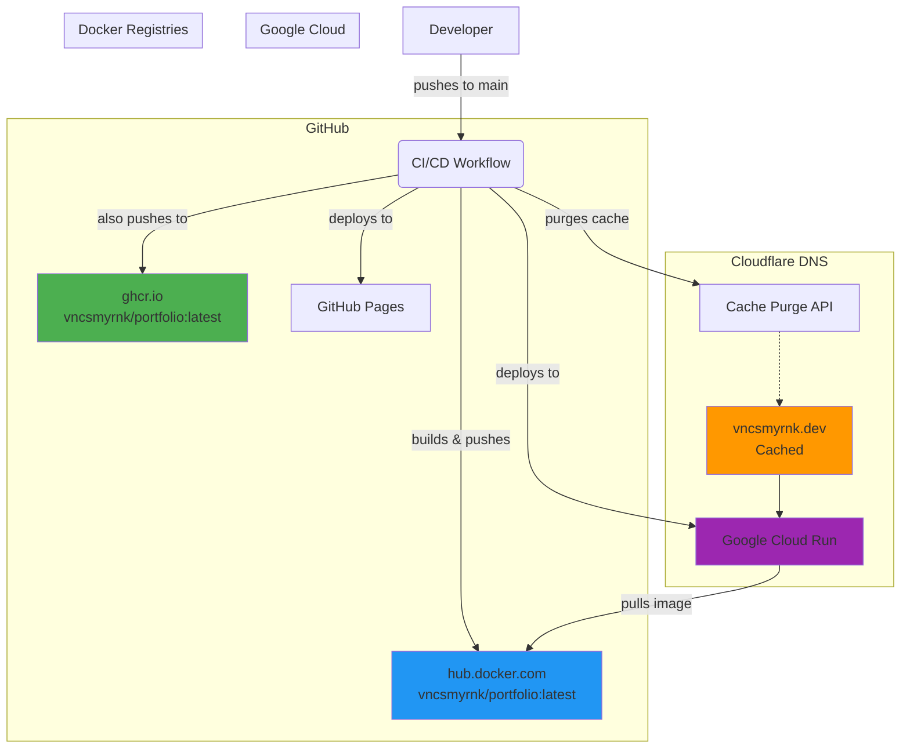

%22&replace=v%241&style=plastic&logo=pnpm&label=pnpm&color=yellow)


<br>

[](https://github.com/prettier/prettier)

# My portfolio

All my skills and accomplishments showcased in one place.

[Check it out!](https://vncsmyrnk.dev)

## Service Architecture


```mermaid
graph TD
    subgraph "Cloudflare DNS"
        A[vncsmyrnk.dev<br/>Cached] --> B[Google Cloud Run];
        G[Cache Purge API] -.-> A;
    end

    subgraph "GitHub"
        C(CI/CD Workflow) --> |"deploys to"| B;
        C --> |"builds & pushes"| D[hub.docker.com<br/>vncsmyrnk/portfolio:latest];
        C --> |"also pushes to"| H[ghcr.io<br/>vncsmyrnk/portfolio:latest];
        C --> |"deploys to"| E[GitHub Pages];
        C --> |"purges cache"| G;
    end

    subgraph "Google Cloud"
        B --> |"pulls image"| D;
    end

    subgraph "Docker Registries"
        D;
        H;
    end

    F[Developer] --> |"pushes to main"| C;

    style A fill:#ff9800
    style D fill:#2196f3
    style H fill:#4caf50
    style B fill:#9c27b0
```

Check [the latest action runs](https://github.com/vncsmyrnk/portfolio/actions) for more information.

## Development

This project uses [just](https://github.com/casey/just) running development tasks.

```sh
just run
```

The local environment should be available at http://localhost:3000.
